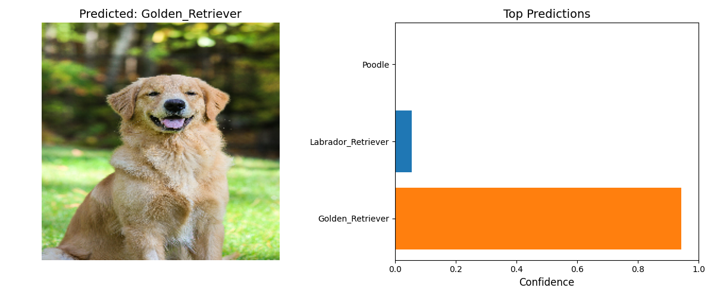

# dog-breed-classifier

A machine learning model that identifies dog breeds from images with high accuracy (~99% validation accuracy).

## Requirements

- Python 3.8+ (tested with Python 3.12)
- Dataset of 10 dog breeds (see Dataset section)
- 4GB+ RAM (no GPU required)

## Dataset

Download the dataset from: [Kaggle - Dog Breed Image Dataset](https://www.kaggle.com/datasets/khushikhushikhushi/dog-breed-image-dataset)

Place the extracted dataset in the `model/` directory with the following structure:

```
dataset/
  ├── Beagle/
  ├── Boxer/
  ├── Bulldog/
  ├── Dachshund/
  ├── German_Shepherd/
  ├── Golden_Retriever/
  ├── Labrador_Retriever/
  ├── Poodle/
  ├── Rottweiler/
  └── Yorkshire_Terrier/
```

## Install requirements

```bash
pip install -r requirements.txt
```

## Train and build model

```bash
python3.12 model.py
```

Output: Creates a trained model file `dog_breed_classifier.keras` and performance visualizations.

## Predict dog breed in CLI

```bash
python3.12 model.py <image_path>
```

Example:

```bash
python3.12 model.py test_dog.jpg
```

## Predict dog breed and create a plot

```bash
python3.12 predict_with_plots.py
```

Output: Creates a visualization showing the predicted breed and confidence scores.


## Model Performance

- Validation Accuracy: ~99%
- Supported Breeds: 10 popular dog breeds
- Processing Time: ~1 second per image on CPU

