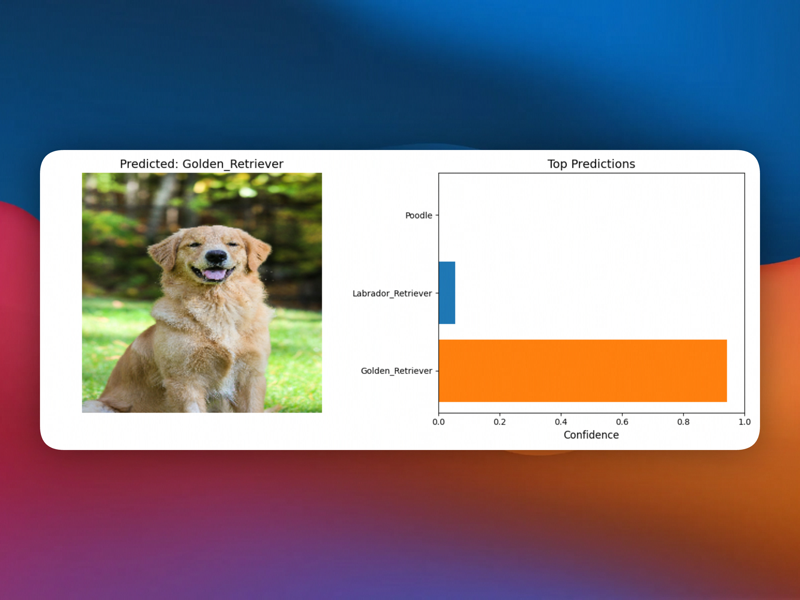
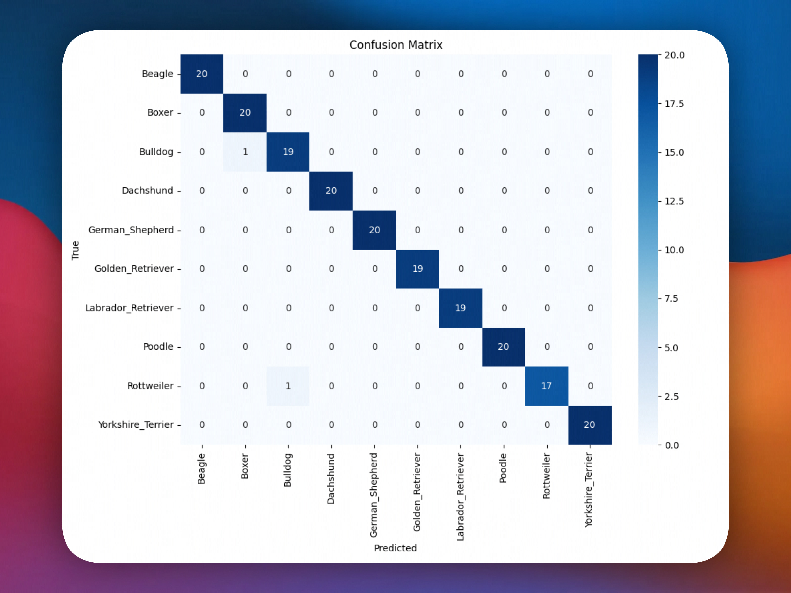
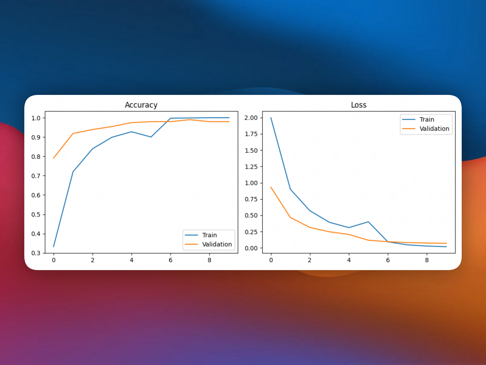

# dog-breed-classifier

A straightforward image classifier that recognizes 10 common dog breeds. The model hits around 99% accuracy on the validation set, and you can run it locally on a standard CPU in about a second per image. 

I built this for an AI class assignment. We had an open-ended prompt to build any model we wanted, and I chose to use it as an opportunity to experiment with image recognition.

## Results

Here is what the model outputs when you pass it a test image:



### Confusion Matrix

The model rarely mixes up these breeds. Here is how its predictions broke down across the validation set:



### Training History

Training converged pretty fast. Here are the accuracy and loss curves from the run:



## Getting Started

You need Python 3.8 or newer. I tested it on Python 3.12. You also need at least 4GB of RAM.

### 1. Download the Dataset

Grab the dataset from [Kaggle - Dog Breed Image Dataset](https://www.kaggle.com/datasets/khushikhushikhushi/dog-breed-image-dataset).

Extract it into the `model/dataset/` directory so the structure looks like this:

```text
model/
  dataset/
    Beagle/
    Boxer/
    Bulldog/
    Dachshund/
    German_Shepherd/
    Golden_Retriever/
    Labrador_Retriever/
    Poodle/
    Rottweiler/
    Yorkshire_Terrier/
```

### 2. Install Dependencies

Move into the `model` directory and install the requirements:

```bash
cd model
pip install -r requirements.txt
```

## Usage

### Training

If you want to train the model from scratch on your own machine:

```bash
cd model
python model.py
```

This run generates the `dog_breed_classifier.keras` file along with the performance plots you see above.

### Predicting in the Terminal

To classify a single image and print the result straight to your console:

```bash
cd model
python model.py <path_to_image>
```

Example:
```bash
python model.py golden_test.jpeg
```

### Predicting with Visuals

If you want to see the confidence scores plotted alongside the image, run the plot script:

```bash
cd model
python predict_with_plots.py
```

This drops a new `prediction_result.png` showing exactly how sure the model is about its guess.

## License

MIT
